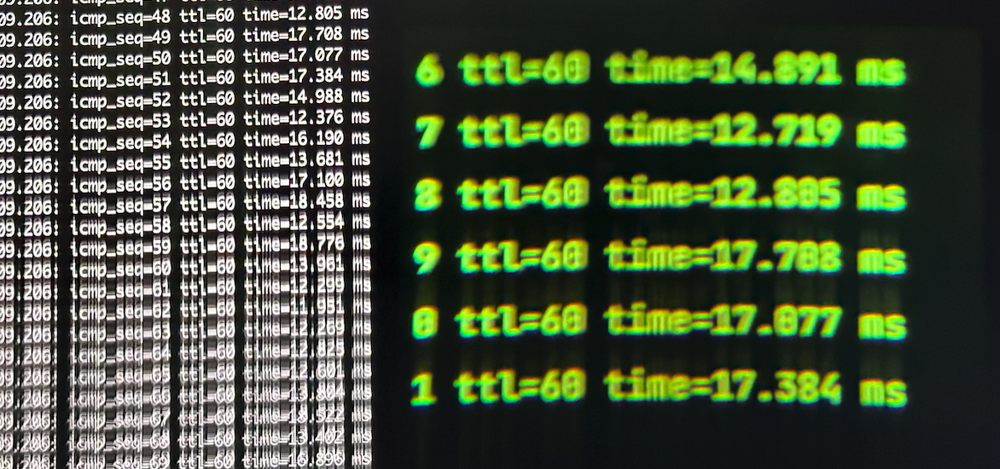

Work in progress

This project uses the Monocle AR device by [Brilliant Labs](https://brilliant.xyz) as a small external display for a terminal window.

Currently it only supports iTerm2 on macOS through their Python API.

Prerequisites:
- Install the iTerm2 Python module: `pip install iterm2`
- Enable the Python API in the preferences of iTerm2
- Grant Bluetooth permission to the terminal in the system preferences of macOS

